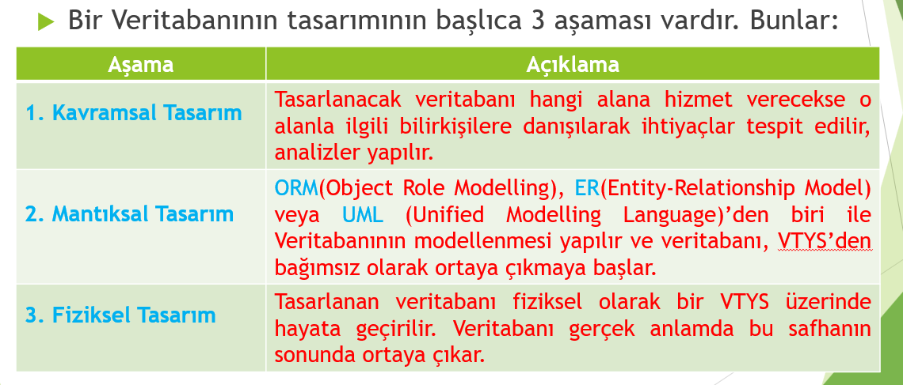
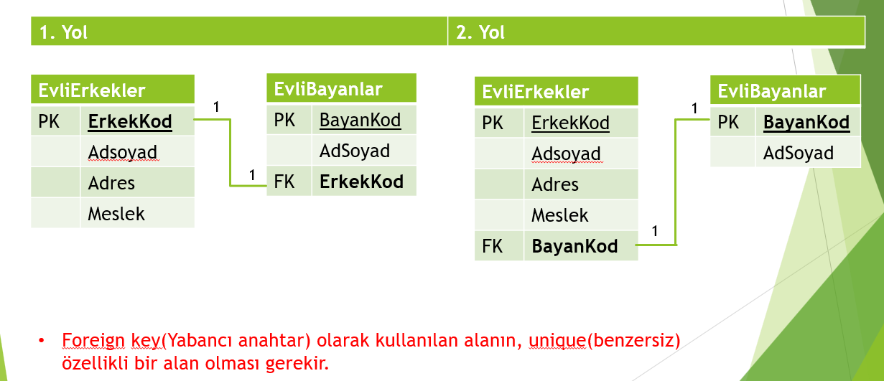
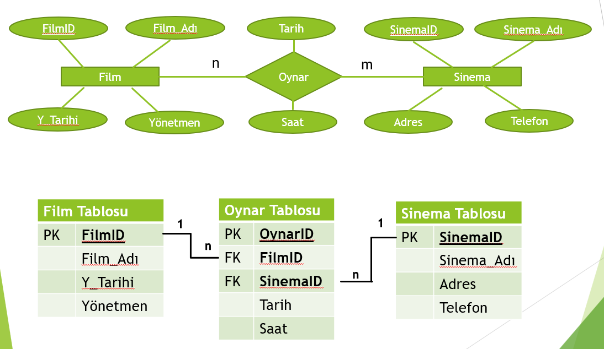

# VeritabanıTasarımı

## Veritabanı Tasarım Aşamaları

## Entity Relationship Model (ER)

## İlişki Türleri
* 1-1 İlişki (Bire-Bir)
İki kayıt kümesinden birindeki bir kaydın diğer tarafta sadece bir kayıtla eşleşmesi durumudur. 
Örneğin bir erkeğin tek bir kadınla evli olması gibi. Tablolar oluşturulurken bir tablonun birincil anahtarı,
diğer tablonun yabancıl anahtarı olarak belirlenir.

* 1-n (Bir-Çok/Çok-Bir)
İki kayıt kümesinden birindeki bir kaydın diğer tarafta birçok kayıtla eşleşmesi durumudur. 
Örneğin bir hastanın defalarca muayene olabilmesi. Tablolar oluşturulurken ilişkinin n tarafındaki tabloya, 1 tarafındaki
tablonun birincil anahtar sütunu yabancıl anahtar olarak eklenir.

* Çoka-Çok (n-m)
İki kayıt kümesinden her iki taraftaki kayıtların diğer tarafta birçok kayıtla eşleşmesi durumudur. 
Örneğin bir filmin aynı anda farklı sinemalarda oynarken bir yandan aynı sinemada başka filmlerin de oynatılabilmesi.
Tablolar oluşturulurken ilişki adında yeni bir tablo oluşturulur ve diğer tabloların birincil anahtarı yeni oluşan
tabloya yabancıl anahtar olarak eklenir. İlişkiden doğan nitelikler de ilişki tablosuna kolon olarak eklenir.

