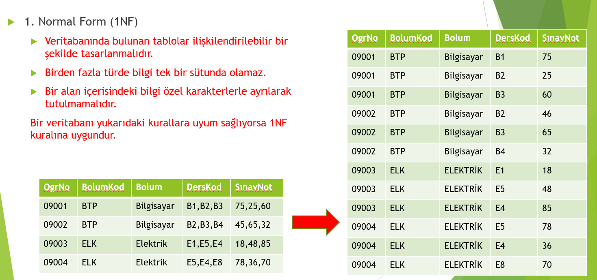
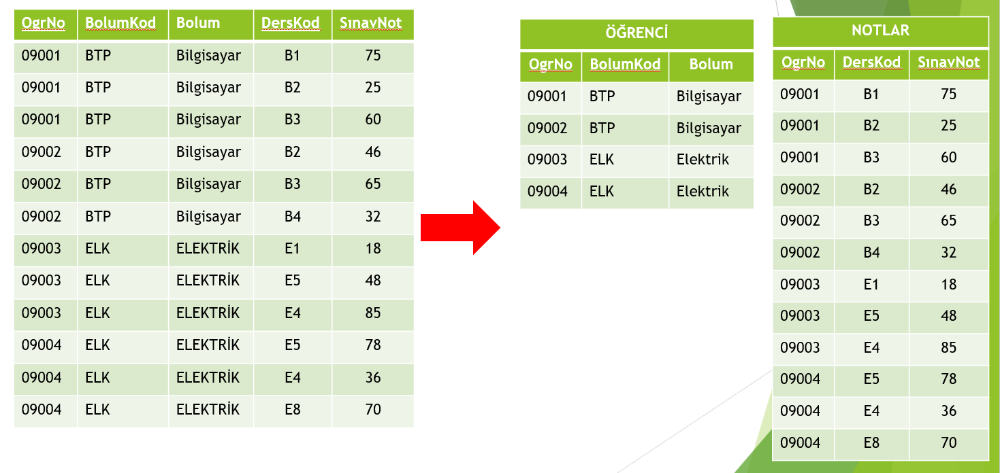
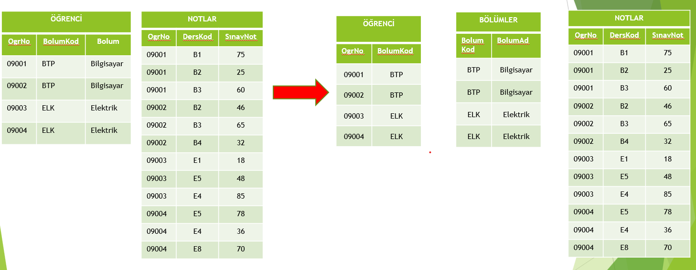
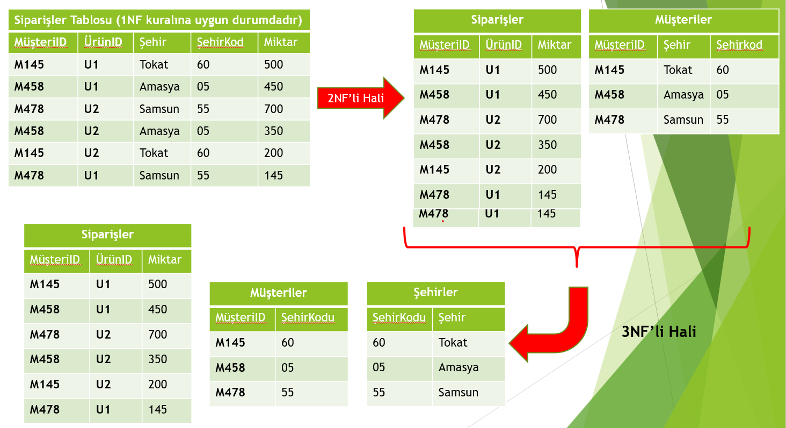

# Normalizasyon

* Normalizasyon, Veritabanının tasarım aşamasında veri tekrarını, veri kaybını veya veri yetersizliğini önlemek için gerçekleştirilen işlemlerdir. 
* Tabloların oluşturulması, tablolar arasında artıklığı ve tutarsızlığı ortadan kaldırma normalizasyonun temel amacıdır. 
* Normalizasyon için gereken birkaç kural vardır. Her bir kurala «Normal Form» ismi verilir. 
* İlk kural kullanılıyorsa, Veritabanının «birinci normal formda (1NF)» olduğu; ikinci kural kullanılıyorsa Veritabanının «ikinci normal formda (2NF)» olduğu,
üçüncü kural kullanılıyorsa Veritabanının «üçüncü normal formda (3NF)» olduğu söylenir. 4 ve 5. Normalizasyon kuralları da vardır ama çoğu uygulama için ilk 3 Normalizasyon kuralı yeterlidir.
* Normalizasyon aynı zamanda çok fazla satır ve sütundan oluşan bir tablonun veri tekrarından korumak için daha az satır ve sütun içeren tablolara ayırma işlemidir. 
* Üst normalizasyon kuralları, alt Normalizasyon kurallarını kapsamaktadır. Yani, 2NF kuralları 1NF kurallarını; 3NF kuralları 1NF ve 2NF kurallarını kapsar. 
* Tek bir sütundaki aynı veri tekrar edebilir. Fakat iki veya daha fazla alandan oluşan bir bilginin birden fazla satırda tekrar etmesi istenilmez.

## Normalizasyonun Amaçları
1. Veri Bütünlüğünü Sağlamak: Örneğin bir veritabanı içerisinde öğrenci numarası birden fazla tabloda kullanıldığında veri bütünlüğü sağlanmazsa zamanla aynı öğrenci için birden fazla numara bilgisi oluşabilecektir. 
1. Uygulamadan Bağımsızlık: Hazırlanacak ilişkisel model kullanılacak uygulamaya göre değil de içereceği veriye göre hazırlanılırsa, kullanılan uygulama değişse bile tasarım sorunsuz olarak çalışmaya devam edebilir.
1. Performansı Arttırmak: Tam olarak normalleştirilmiş veritabanında veri tekrarı en aza ineceği için kullanılan disk alanı ve veritabanı boyutu da azalacaktır. Böyle bir veritabanında işlemler daha hızlı yapılabilecektir.

## Normalizasyon Kuralları

1. Birinci Normal Form (1NF)

* Bir alan içerisindeki bilgi özel karakterlere ayrılarak tutulmamalıdır.
* Birden fazla bilgi tek bir sütunda olamaz. (Ad Soyad için tek bir sütun oluşturmaktansa Ad için ayrı Soyad için ayrı sütun oluşturulmalıdır örneği verilebilir)
* Tekrarlanan sütun yapıları olmalıdır.
 

2. İkinci Normal Form (2NF)

* 1NF kuralının uygulanmış olması beklenir.
* Bir tablo içinde tanımlı ve anahtar olmayan her sütun, birincil anahtar olarak tanımlı anahtar sütuna bağımlı olmalıdır.
* Anahtar sütun, birden fazla sütunun birleşiminden oluşuyorsa tabloda yer alacak veriler iki sütuna da bağımlı olmalıdır. Tek sütuna bağımlı ise ayrı bir tabloda tutulmalıdır.

3. Üçüncü Normal Form (3NF)

* Anahtar olmayan sütunlar ya başka bir tablonun birincil anahtarını (PK) referans göstermeli (FK “ikincil anahtar”) ya da aynı tabloda ki diğer alanlar ile doğrudan ilişkili olmalıdır.

