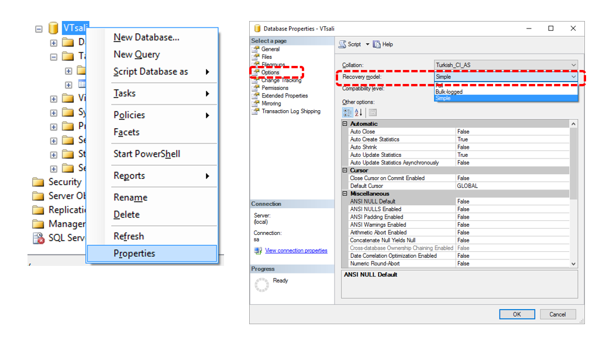
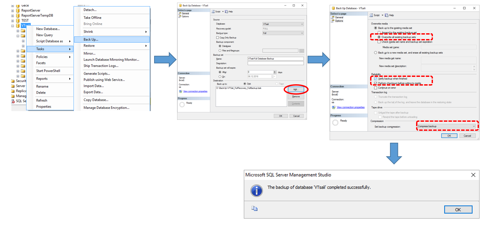
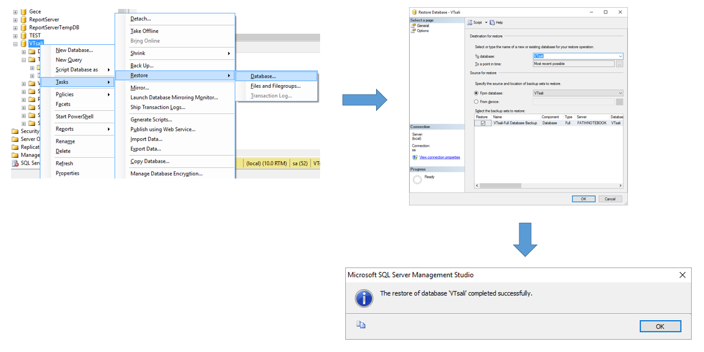
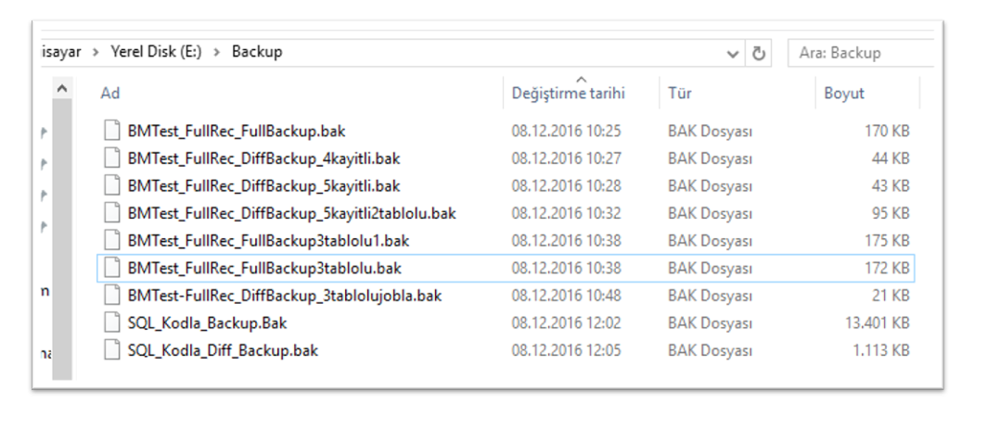

# Backup / Restore

* Simple Recovery Model

En temel kurtarma türü olup, küçük çaplı ve sadece sorgulama için kullanılan veritabanlarında kullanılır. Transaction loglar (Insert/Update/… gibi VT’de yapılan değişikliklere dair kayıtlar) kaydedilmez ve veritabanına ait transaction loglar aktif değilse silinir. Bu yüzden en son yedekten sonra yapılan değişiklikler kayıt altına alınmadığı için o aradaki değişiklikler geri alınamaz. 

* Full Recovery Model

Bu modelde transaction loglar kaydedilir ve mevcut bir yedek geri yüklendiğinde veritabanındaki verilerle beraber tüm transaction loglar da geri yüklenir. Bu yüzden bu modelde son ana kadar yapılmış olan tüm değişiklikler kurtarılabilir veya veritabanının istenilen bir zamandaki haline geri dönülebilir. Veri kaybı riskinin yüksek olduğu veritabanlarında tercih edilir.

* Bulk-Logged Recovery Model

Simple ve Full recovery modelleri arasındadır. Bulk işlemler (örneğin txt bir dosyadaki verilerin SQL veritabanına aktarılması vb.) dışındaki tüm işlemler loglanır. Bulk işlemi sırasında istenmeyen bir durum oluşursa bu süreçte yapılan değişiklikler geri alınamaz. Herhangi bir sorun durumunda veritabanının eski haline dönülmek istendiğinde bulk işlemler dışındaki tüm işlemler ve verilerin son durumu elde edilebilir.

## Veritabanının Recovery Modelinin Öğrenilmesi



Recovery Model’in SQL ile değiştirilmesi:

```sql
ALTER DATABASE VTSali SET RECOVERY Simple / Full / Bulk_Logged
```

## Yedekleme Türleri

### Full Backup (Tam Yedekleme)

Veritabanı’nın tamamını yedekleme işlemidir. Onaylanmamış transaction log yedekleri de alınır. Diğer yedekleme seçenekleri için de başlangıç noktasıdır. Yoğun transaction işlemlerinin olmadığı küçük veritabanlarında ve kısa süreli veri kaybının önemli olmadığı veritabanlarında tercih edilir. 

### Differential Backup (Fark Yedekleme)

En son alınan Full yedekten sonraki yapılan değişikliklerin yedeklendiği türdür. Sadece farklılıklar yedeklendiği için Full’e göre daha hızlı ve boyut olarak daha küçüktür.

### Transaction Log Backup (İşlem Günlüğü Yedekleme)

Sadece transaction logların yedeğini alır. Öncesinde bir kez Full yedek alınmalıdır. Bu yedekleme ile herhangi bir andaki noktaya geri dönülebilir. Veri kaybı riskinin fazla olduğu ve yoğun transaction işlemleri olan senaryolarda belli aralıklarla yapılması önerilir. Simple Recovery Model’de desteklenmez. 

## Full Recovery Model’de Full Backup



## Full Model’de Restore

* Restore işlemi öncesinde, veritabanına tüm bağlantılar kapatılmalıdır. Yoksa hata verecektir.
* Backup alındıktan sonra oluşturulmuş olan tablolar veya varolan bir tabloya backup sonrasında girilmiş olan veriler gibi değişikliklerin tamamı Recovery yapıldığında kaybolacaktır.



## Farklı Backup Türlerinin Dosya Boyutları

Differential Backup’ların boyutları, Full Backup’lardan daha azdır.



## Backup-Restore’un SQL Kodlarıyla Yapılması

```sql
BACKUP DATABASE TEST TO DISK='E:\BACKUP\SQL_Kodla_Backup.Bak' 
WITH INIT -- WITH INIT: Aynı konum ve isimde önceden varolan dosya varsa üzerine yazar.

BACKUP DATABASE TEST TO DISK='E:\BACKUP\SQL_Kodla_Diff_Backup.bak' 
WITH DIFFERENTIAL

RESTORE DATABASE TEST FROM DISK='E:\BACKUP\SQL_Kodla_Backup.bak'
WITH REPLACE
```

## BackUp İşleminin Job Olarak Yapılması


